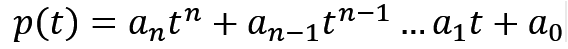

Here are some solutions to the questions in the work book **Polynomial** by Edward J. Barbeau

<h3>Chapter 1</h3>
<ul>
<li><h5>Section 1</h2></li>

<li><h5><a href="https://www.sharelatex.com/project/582166f634d2a43b682a5c9e" target="_blank">Section 2</a></h5></li>

<li><h5>Section 3</h5></li>
</ul>